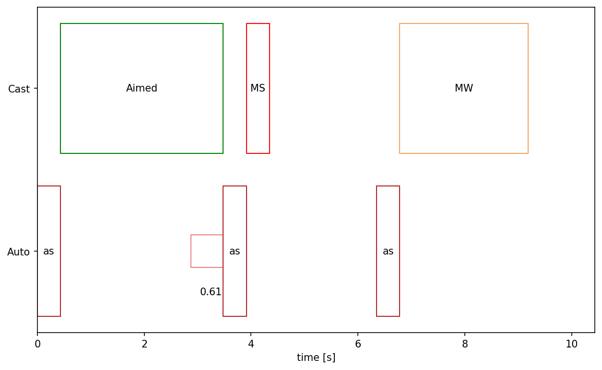
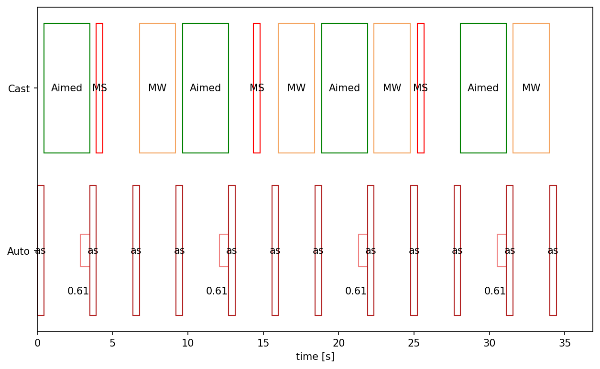

## Hunter notes for Season of Mastery

## Useful links

### Guides and videos

- [Classic & TBC Hunter discord](https://discord.gg/classichunter)
- [WatchYourSixx' Hunter Sim Spreadsheet](https://docs.google.com/spreadsheets/d/1BIlB2P1kyV_QdD4ULQzvZvS6hK6BDouUQkyHQzCvBGI/edit?usp=drivesdk)
- [Petopia Classic](https://www.wow-petopia.com/classic/)
- [Bouk's supplementary hunter guide](https://boukx.github.io/guide/)
- [Bouk's phase 6 guide](https://boukx.github.io/phase6/)
- [Sixx' weaving guide: Raptor Strike and you](https://www.reddit.com/r/classicwow/comments/fh6ofy/raptor_strike_and_you_a_detailed_analysis_and/)
- [zeroji DM:T speedrun](https://www.twitch.tv/videos/765188893)
- [zeroji DM:T safe run](https://www.youtube.com/watch?v=Lzvq5kZMo4U)
- [my own DM:T run](https://www.youtube.com/watch?v=rDsMcZuMUlY) and [on a lvl 56 hunter](https://www.youtube.com/watch?v=7uRzutJf45w)

### WeakAuras

- [Rat's Hunter Range Badges](https://wago.io/Wxr2Iku2b)
- [Rat's Hunter Raid Debuff Tracker](https://wago.io/90FK66Stl)
- [Hunter Efficiency Timer](https://wago.io/oYIjS228K)
- [Weave Component Timer](https://wago.io/oBjregGjL)
- [Predictive Weave Bar](https://wago.io/K6nl2clmn)
- [bouk's Castbar](https://discord.com/channels/253213664708919296/253944545429946369/908384262183604236) on Hunter Discord, wago.io version is broken

## Additional notes

### Pet progression

Best pet for solo stuff, instances and raids is any type of (flying) bird for https://classic.wowhead.com/spell=24579/screech. This is great for solo play due to its high threat generation and AP reduction to enemies, which reduces incoming damage to the tank (or your pet in solo play). The natural choices for pets thus are an owl for alliance that can be tamed in Teldrassil, or a bat for horde that can be found in Tirisfal Glades.

To get and upgrade your https://classic.wowhead.com/spell=24579/screech ability, new pets must be tamed from time to time:

| Screech rank                                    | Beast to tame                                                |
| ----------------------------------------------- | ------------------------------------------------------------ |
| https://classic.wowhead.com/spell=24423/screech | https://classic.wowhead.com/npc=154                          |
| https://classic.wowhead.com/spell=24577/screech | https://classic.wowhead.com/npc=4158                         |
| https://classic.wowhead.com/spell=24578/screech | https://classic.wowhead.com/npc=7097                         |
| https://classic.wowhead.com/spell=24579/screech | https://classic.wowhead.com/npc=8602, https://classic.wowhead.com/npc=7456 |

For ranks 2 and 3 there are also other choices, but those listed here are the first available. For more information on pets in general, see [Petopia Classic](https://www.wow-petopia.com/classic/).

### Leveling rotation

- You can try the raiding rotation outlined below, but usually mobs die too quickly and you run out of mana too quickly to really do this while leveling
- https://classic.wowhead.com/spell=14325/hunters-mark is usually not worth its mana cost unless you are fighting elite mobs.
- When leveling as Beastmaster, you don't have access to https://classic.wowhead.com/spell=20904/aimed-shot for a long time. https://classic.wowhead.com/spell=14287/arcane-shot is usually also not worth its mana cost
- If mobs live long enough, you can place https://classic.wowhead.com/spell=25295/serpent-sting on them
- You can have your pet tank one (or more with https://classic.wowhead.com/spell=24579/screech) mob(s), shoot this mob and weave in melee hits on another mob that is targeting you. Keep in mind that you do take damage yourself in this case.

### Raiding rotation

Basically, you use special attacks in the downtime between each https://classic.wowhead.com/spell=75/auto-shot. The highest priority is https://classic.wowhead.com/spell=20904/aimed-shot, followed by https://classic.wowhead.com/spell=14290/multi-shot and melee weaving with https://classic.wowhead.com/spell=14266/raptor-strike. Because this is just a bit short of 10 seconds, https://classic.wowhead.com/spell=14290/multi-shot will still be on cooldown in the next repitition, so that it gets delayed with a bit with every rotation. Usually on the third rotation, you can melee weave one cycle earlier and after 4 rotations you have to delay the https://classic.wowhead.com/spell=14290/multi-shot until after the next https://classic.wowhead.com/spell=20904/aimed-shot, so that the full rotation looks roughly like this:

This gets changed up a bit with procs of https://classic.wowhead.com/spell=19556/improved-aspect-of-the-hawk as this hastens your https://classic.wowhead.com/spell=75/auto-shot as well as your https://classic.wowhead.com/spell=20904/aimed-shot casts, but does not reduce your spell cooldowns. In this case, just use the highest priority ability from your list:

1. https://classic.wowhead.com/spell=20904/aimed-shot
2. https://classic.wowhead.com/spell=14290/multi-shot
3. https://classic.wowhead.com/spell=14266/raptor-strike

If you encounter mana issues, your options are:

1. down-rank https://classic.wowhead.com/spell=2973/raptor-strike
2. down-rank https://classic.wowhead.com/spell=2643/multi-shot (single-target fights)
3. replace https://classic.wowhead.com/spell=2973/raptor-strike with melee white hits

Down-ranking the melee weaves lets them remain special attacks, thus not suffering from glancing blows. If you have to omit the https://classic.wowhead.com/spell=2973/raptor-strike and use white hits instead, melee damage will suffer from the severe reduction of glancing blows.

### Gear progression

With Dire Maul available on release, hunters in Season of Mastery have plenty of gearing options.

| Gear set                                                     | DPS (normal) | DPS (weaving) |
| ------------------------------------------------------------ | ------------ | ------------- |
| [True R13](https://sixtyupgrades.com/set/twGvoaHf1axk2htRuFNYZw) | 692          | 745           |
| [Realistic R13](https://sixtyupgrades.com/set/vftXpGC6YbEEuyaqD9kXKb) | 690          | 742           |
| [Realistic R12+WSG](https://sixtyupgrades.com/set/nz6PD3musdaiJk7BCPWiVV) | 686          | 739           |
| [Realistic R12](https://sixtyupgrades.com/set/m6tbs18Fg3eUybU5C6x1Br) | 680          | 732           |
| [Realistic R10 + D3 Boots](https://sixtyupgrades.com/set/q7Q76Jeme7FFbMLdEmN4ue) | 678          | 730           |
| [Realistic R10](https://sixtyupgrades.com/set/88kjyYHyQWJ17RTKDZHcHc) | 675          | 727           |
| [Realistic T1 8/8](https://sixtyupgrades.com/set/2s5fDJXjowAkVe2V9Qq8AE) | 674          | 725           |
| [Preraid R10 + Rhok'delar](https://sixtyupgrades.com/set/pdH2Sq7nLqhtmftxsCRicn) | 660          | 713           |
| [Preraid R10](https://sixtyupgrades.com/set/sAstCzejYx6QG9W5JKPMvo) | 654          | 707           |
| [Preraid R8](https://sixtyupgrades.com/set/ii3iY1yPZpreFJjyz337hV) | 648          | 698           |
| [Preraid D2 6/8](https://sixtyupgrades.com/set/uhYzivnfyBpUm4zFKMiCFk) | 636          | 680           |
| [Preraid no-PvP no-D2 no-Summon](https://sixtyupgrades.com/set/mjj8hc9mkaCKVVMzBSGDB) | 633          | 679           |

Although the Dungeon 2 set is in the game from release it is not the best pre-raid gear achievable for hunters. Using https://classic.wowhead.com/item-set=143/devilsaur-armor and select pieces from Dire Maul and other instances yields better dps. Nevertheless, especially for solo play, the unique pet bonuses of the Dungeon 2 set can be relevant.

All preraid sets were simulated with a 2/31/18 spec to get closer to hit cap, while 20/31/0 offers an increase of around 50 dps **if pets stay alive** and at the expense of missing a few shots which might be especially unpleasant with Magmadar for https://classic.wowhead.com/spell=19801/tranquilizing-shot. Replacing the https://classic.wowhead.com/item=10548/sniper-scope with a https://classic.wowhead.com/item=18283/biznicks-247x128-accurascope will allow you to switch the spec without losing hit, but due to the prohibitive cost this should only be advised after obtaining your first raid weapon.

#### Biggest upgrades in phase 1

Obviously, https://classic.wowhead.com/item=18713/rhokdelar-longbow-of-the-ancient-keepers is the one item most hunters will want out of Molten Core. Keep in mind though that with https://classic.wowhead.com/item=19107/bloodseeker we have a very solid pre-raid weapon available that is only 5-10 dps behind Rhok'delar due to the difference in weapon speed. https://classic.wowhead.com/item=18715/lokdelar-stave-of-the-ancient-keepers is a solid melee weaving weapon despite its lacking stats. Compared to https://classic.wowhead.com/item=18520/barbarous-blade, Lok'delar will give you more damage to your melee hits while giving slightly worse stats for ranged attacks. Once players progress further into the T0.5 quest line, https://classic.wowhead.com/item=22314/huntsmans-harpoon is the best phase 1 melee weaving weapon. It drops off the summoned T0.5 quest boss in Dire Maul East.

If you do not aim for tier set completion, https://classic.wowhead.com/item=18812/wristguards-of-true-flight are a big upgrade over other options available for the wrist slot.

The single biggest upgrade in phase 1 will be the https://classic.wowhead.com/item=18404/onyxia-tooth-pendant received from turning in https://classic.wowhead.com/item=18423/head-of-onyxia. As your raid should be getting one of these every 5 days, you should be getting this item in due time.

The tier 1 set is also a very solid option for gearing, especially the 8-piece set bonus is a large dps boost. Keep in mind that with Season of Mastery's faster phase progression your raid will be hard pressed to give the full set to many hunters. The same goes for the two pieces of the tier 2 set that are available in phase 1 - get your hands on them if you can, but don't count on completing the set before it becomes obsolete.

#### Items you should not want

In any case, do not take https://classic.wowhead.com/item=17063/band-of-accuria or https://classic.wowhead.com/item=18821/quick-strike-ring away from your melee players. While these two rings are technically the best rings for hunters in phase 1, they get quickly replaced and should be better left for those who will use them for longer.

This also holds for one-handed melee weapons like https://classic.wowhead.com/item=18832/brutality-blade and https://classic.wowhead.com/item=18805/core-hound-tooth as rogues and fury warriors can gain more from using them. You should also be melee weaving in any case, for which you need a two-handed weapon.

### Stat weights

For comparing items on databases like sixtyupgrades, the stat weights for hunters in phase 1 are roughly:

| Stat                     | Weight with preraid gear | Weight with BiS set        |
| ------------------------ | ------------------------ | -------------------------- |
| 1 AP                     | 1                        | 1                          |
| 1 Agility                | 2.8 alliance / 2.5 horde | 2.95 alliance / 2.65 horde |
| 1% Crit                  | 28                       | 35                         |
| 1% Hit                   | 22                       | 0 (hit capped)             |
| 1 Ranged Weapon DPS      | 40                       | 40                         |
| +0.1 Ranged Weapon Speed | 120                      | 135                        |

Keep in mind that stat weights change as your gear changes, so this should only be used for small upgrades from the sets shown above, as can be seen for the two different weights shown here.

The last row shows why https://classic.wowhead.com/item=19107/bloodseeker is so good: Hunter dps scales nicely with weapon speed as this reduces clipping of the https://classic.wowhead.com/spell=75/auto-shot following your https://classic.wowhead.com/spell=20904/aimed-shot.

---

### Acknowledgement

Thanks go out to all those contributing the content listed in the useful links section.

If you feel like something is missing, feel free to contact Diziet#0189 on the [Classic & TBC Hunter discord](https://discord.gg/classichunter).

